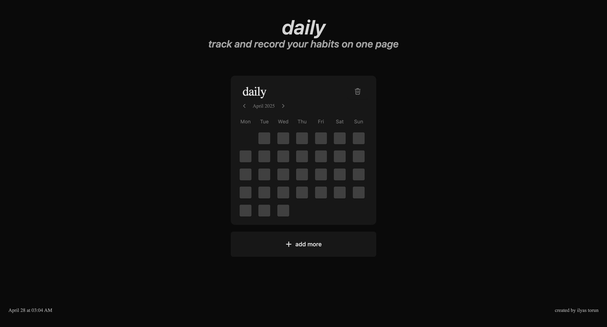

# Daily - Habit Tracking App

Daily is a minimalist habit tracking web application that helps you monitor and maintain your daily routines. Built with React and modern web technologies, it offers a clean and intuitive interface for tracking multiple habits simultaneously.



## Features

- 📊 Visual habit tracking with monthly calendar view
- 💾 Local storage persistence
- 📱 Responsive design for all devices
- ➕ Multiple habit cards support
- 🎨 Clean, modern dark theme interface
- 📅 Monthly navigation for each habit
- ✏️ Editable habit titles
- 🔄 Real-time date and time display

## Tech Stack

- React
- Tailwind CSS
- shadcn/ui
- date-fns
- React Icons
- Local Storage API

## Getting Started

### Prerequisites

- Node.js (v14 or higher)
- npm or yarn

### Installation

1. Clone the repository
```bash
git clone https://github.com/ilyastorunn/habits.git
```

2. Navigate to the project directory
```bash
cd habits
```

3. Install dependencies
```bash
npm install
# or
yarn install
```

4. Start the development server
```bash
npm run dev
# or
yarn dev
```

5. Open your browser and visit `http://localhost:5173`

## Usage

- Click "add more" to create a new habit card
- Click on the habit title to edit it
- Use the calendar checkboxes to track your daily progress
- Navigate between months using the arrow buttons
- Your data is automatically saved to local storage

## Contributing

Contributions are welcome! Feel free to submit issues and pull requests.

1. Fork the repository
2. Create your feature branch (`git checkout -b feature/AmazingFeature`)
3. Commit your changes (`git commit -m 'Add some AmazingFeature'`)
4. Push to the branch (`git push origin feature/AmazingFeature`)
5. Open a Pull Request

## License

This project is licensed under the MIT License - see the [LICENSE](LICENSE) file for details.

## Contact

İlyas Torun - [@ilyastorunn](https://github.com/ilyastorunn)

Project Link: [https://github.com/ilyastorunn/habits](https://github.com/ilyastorunn/habits)

## Acknowledgments

- [shadcn/ui](https://ui.shadcn.com/) for the beautiful UI components
- [Tailwind CSS](https://tailwindcss.com/) for the styling system
- [date-fns](https://date-fns.org/) for date manipulation

